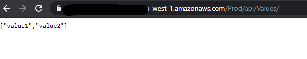
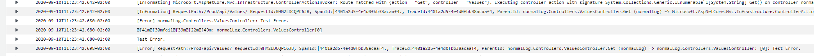
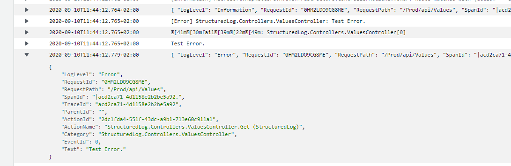
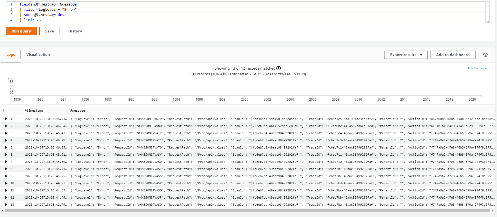

# Structured Logging with .net Core for Web Apis running on Lambda

The default logging when creating a .net Core Web Api and running it on lambda is easy, but not always the best way to get all the needed information into the logs. There are multiple logging Frameworks that support structured logging but sometimes using the default ILogger just works best. This is especially true for usage in Libraries, using the default logger interface reduces dependencies and makes it easier to use.

## Adding the Lambda Logger to your Project

To add your logs from your .net Core WebApi to CloudWatch just add the following code to your project.

Note: I used the [AWS Toolkit for Visual Studio](https://aws.amazon.com/visualstudio/) to create the project.
Create an AWS Serverless Application (.NET Core - C#). Then select the ASP.NET Core Web API Blueprint. This will include almost everything you need for this example.

Next I added the LambdaLogger and configuration. This goes into the Startup.cs file and use the default ILogger from .NET Core to log.

```C#
public void Configure(IApplicationBuilder app, IWebHostEnvironment env, ILoggerFactory loggerFactory)
{
    var loggerOptions = new LambdaLoggerOptions
    {
        IncludeCategory = true,
        IncludeLogLevel = true,
        IncludeNewline = true,
        IncludeException = true,
        IncludeEventId = true,
        IncludeScopes = true
    };
    loggerFactory.AddLambdaLogger(loggerOptions);
            ...

```

The next step is to add the ILogger to your controller. I just used the example ValuesController to demonstrate the default way the lambda logger logs.

```C#
[Route("api/[controller]")]
public class ValuesController : ControllerBase
{
    private readonly ILogger<ValuesController> _logger;

    public ValuesController(ILogger<ValuesController> logger)
    {
        _logger = logger;
    }

    // GET api/values
    [HttpGet]
    public IEnumerable<string> Get()
    {
        _logger.LogError("Test Error.");
        return new string[] { "value1", "value2" };
    }
    ...
```

After that we can deploy our WebAPI to AWS Lambda.
Then we should see that everything works.

Copy the URL from the deployment and add the path to you controller.



If you take a look at the LogGroup in Cloudwatch you should be able to see all the logs.



This is already helpful, but the LogLevel and addational information is missing in this.
So lets see how we can add it to CloudWatch as well.

## Creating a Structured Logger to output additional information

In order to output your errors as a JSON object and add additional information we will need to create our own implementation for the logger class. For this, we will use the normal AWS Amazon.Lambda.Core.LambdaLogger.

The resulting logs could look something like this:



To get there we will need to do some coding. We will need to create the following classes.

### ErrorMessage.cs
This class is used to Store information about exceptions. We will keep the Exception Message and the stack trace in this class if needed.

```C#
public class ErrorMessage
{
    public string Error { get; set; }
    public string StackTrace { get; set; }
}
```

### NullExternalScopeProvider.cs
This is just a copy of the non-public logger class from dotnet.

```C#
public class NullExternalScopeProvider : IExternalScopeProvider
{
    private NullExternalScopeProvider()
    {
    }

    public static IExternalScopeProvider Instance { get; } = new NullExternalScopeProvider();

    void IExternalScopeProvider.ForEachScope<TState>(Action<object, TState> callback, TState state)
    {
    }

    IDisposable IExternalScopeProvider.Push(object state)
    {
        return NullScope.Instance;
    }
}

public class NullScope : IDisposable
{
    public static NullScope Instance { get; } = new NullScope();

    private NullScope()
    {
    }

    public void Dispose()
    {
    }
}
```

### NoOpDisposable.cs
This class is an empty disposable object. It is used to create an easy to dispose object if no Scope is provided in the logger. (See LambdaJsonlogger.cs Line 106).

```C#
public class NoOpDisposable : IDisposable
{
    public void Dispose()
    {
    }
}
```

### LogEntry.cs
This class is used to store a single log entry.

```C#
public class LogEntry : Dictionary<string, object>
{
    private readonly List<object> _scopeItems = new List<object>();

    public void AddScope(object scopeValue)
    {
        if (scopeValue == null) return;
        _scopeItems.Add(scopeValue);
        base["Scope"] = _scopeItems;
    }
}
```

### LambdaJsonLoggerProvider.cs
This is implementing ILoggerProvider in order to create an instance of our logger.

```C#
public class LambdaJsonLoggerProvider : ILoggerProvider, ISupportExternalScope
{
    private readonly LambdaLoggerOptions _options;
    private IExternalScopeProvider _scopeProvider;
    private readonly ConcurrentDictionary<string, LambdaJsonLogger> _loggers;

    private const string DEFAULT_CATEGORY_NAME = "Default";

    public LambdaJsonLoggerProvider(LambdaLoggerOptions options)
    {
        if (options == null)
        {
            throw new ArgumentNullException(nameof(options));
        }

        _options = options;
        _loggers = new ConcurrentDictionary<string, LambdaJsonLogger>();
        _scopeProvider = options.IncludeScopes ? new LoggerExternalScopeProvider() : NullExternalScopeProvider.Instance;
    }

    public ILogger CreateLogger(string categoryName)
    {
        var name = string.IsNullOrEmpty(categoryName) ? DEFAULT_CATEGORY_NAME : categoryName;

        return _loggers.GetOrAdd(name, loggerName =>
        {
            return new LambdaJsonLogger(name, _options)
            {
                ScopeProvider = _scopeProvider
            };
        });
    }

    public void SetScopeProvider(IExternalScopeProvider scopeProvider)
    {
        _scopeProvider = scopeProvider;

        foreach (var logger in _loggers)
        {
            logger.Value.ScopeProvider = _scopeProvider;
        }
    }

    public void Dispose()
    {
    }
}
```

### LambdaJsonLogger.cs
Is our implementation of a default Ilogger.
It uses the Amazon.Lambda.Core.LambdaLogger.Log method from the AWS Lambda Logger in order to write the actual log to cloudwatch.

```C#
public class LambdaJsonLogger : ILogger
{

    private readonly string _categoryName;
    private readonly LambdaLoggerOptions _options;

    public IExternalScopeProvider ScopeProvider { get; set; }

    public LambdaJsonLogger(string categoryName, LambdaLoggerOptions options)
    {
        _categoryName = categoryName;
        _options = options;
    }

    public void Log<TState>(LogLevel logLevel, EventId eventId, TState state, Exception exception, Func<TState, Exception, string> formatter)
    {
        if (formatter == null)
        {
            throw new ArgumentNullException(nameof(formatter));
        }

        if (!IsEnabled(logLevel))
        {
            return;
        }

        var logEntry = new LogEntry();

        if (_options.IncludeLogLevel)
        {
            logEntry.Add("LogLevel", logLevel.ToString());
        }

        CreateScopeInformation(logEntry);

        if (_options.IncludeCategory)
        {
            logEntry.Add("Category", _categoryName);
        }

        if (_options.IncludeEventId)
        {
            logEntry.Add("EventId", eventId.Id);
        }

        var text = formatter.Invoke(state, exception);
        logEntry.Add("Text", text);

        if (_options.IncludeException && exception != null)
        {
            logEntry.Add("Exception", new ErrorMessage { Error = exception?.Message, StackTrace = exception?.StackTrace });
        }

        var options = new JsonSerializerOptions
        {
            WriteIndented = true,
            IgnoreNullValues = true,
            PropertyNamingPolicy = JsonNamingPolicy.CamelCase,
        };

        var json = JsonSerializer.Serialize<LogEntry>(logEntry, options);
        Amazon.Lambda.Core.LambdaLogger.Log(json);
    }

    private void CreateScopeInformation(LogEntry logInfo)
    {
        var scopeProvider = ScopeProvider;

        if (_options.IncludeScopes && scopeProvider != null)
        {
            scopeProvider.ForEachScope((scope, logItem) =>
            {
                if (scope is IEnumerable<KeyValuePair<string, object>> keyValuePairs)
                {
                    foreach (var item in keyValuePairs)
                    {
                        logItem[item.Key] = item.Value;
                    }
                }
                else if (scope is KeyValuePair<string, object> keyValue)
                {
                    logItem[keyValue.Key] = keyValue.Value;
                }
                else
                {
                    logItem.AddScope(scope);
                }
            }, (logInfo));
        }
    }

    public IDisposable BeginScope<TState>(TState state) => ScopeProvider?.Push(state) ?? new NoOpDisposable();

    public bool IsEnabled(LogLevel logLevel)
    {
        return (_options.Filter == null || _options.Filter(_categoryName, logLevel));
    }
}
```

Once implemented you will need to tell your code to use it, for this modify your Startup.cs
```C#
public void Configure(IApplicationBuilder app, IWebHostEnvironment env, ILoggerFactory loggerFactory)
{
    var loggerOptions = new LambdaLoggerOptions
    {
        IncludeCategory = true,
        IncludeLogLevel = true,
        IncludeNewline = true,
        IncludeException = true,
        IncludeEventId = true,
        IncludeScopes = true
    };

    var provider = new LambdaJsonLoggerProvider(loggerOptions);
    loggerFactory.AddProvider(provider);
    ...
```

After that just deploy your Web API to Lambda and hit the endpoint at least once.
The result should look something like my example above.


Using this you should be able to add all the fields/information you need to your logger and find all the infortmation needed to investigate you logs and find problems.

Combined with the use of Logs Insights you are now able to just see the logs with the LogLevel Error for example by using:

```C#
fields @timestamp, @message
| filter LogLevel = "Error"
| sort @timestamp desc
| limit 25
```

